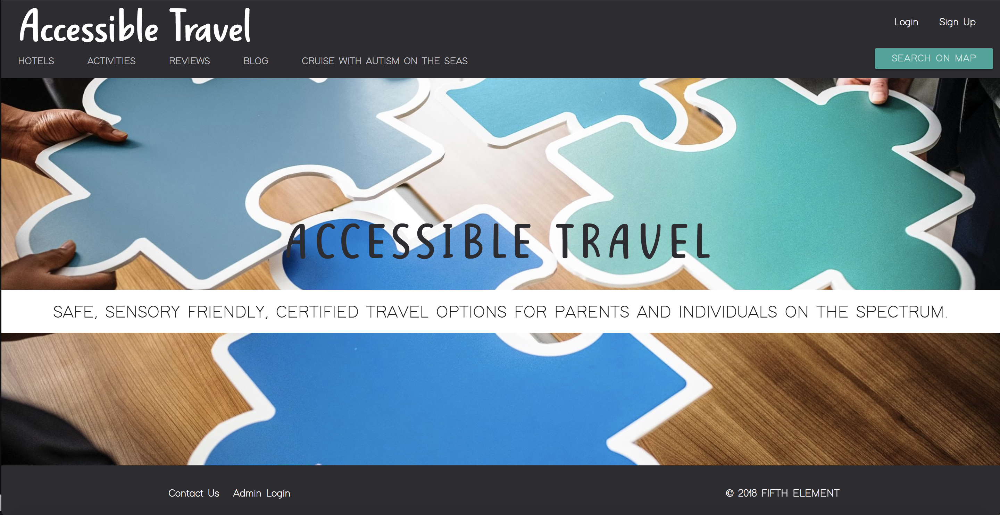
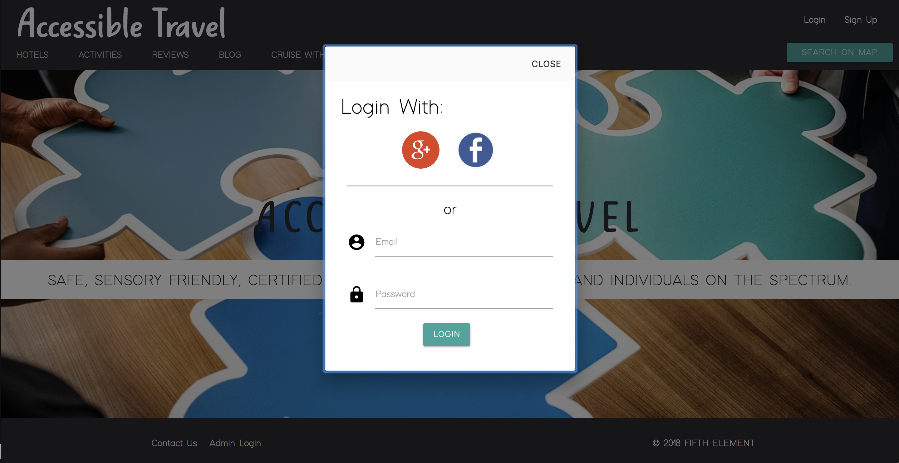
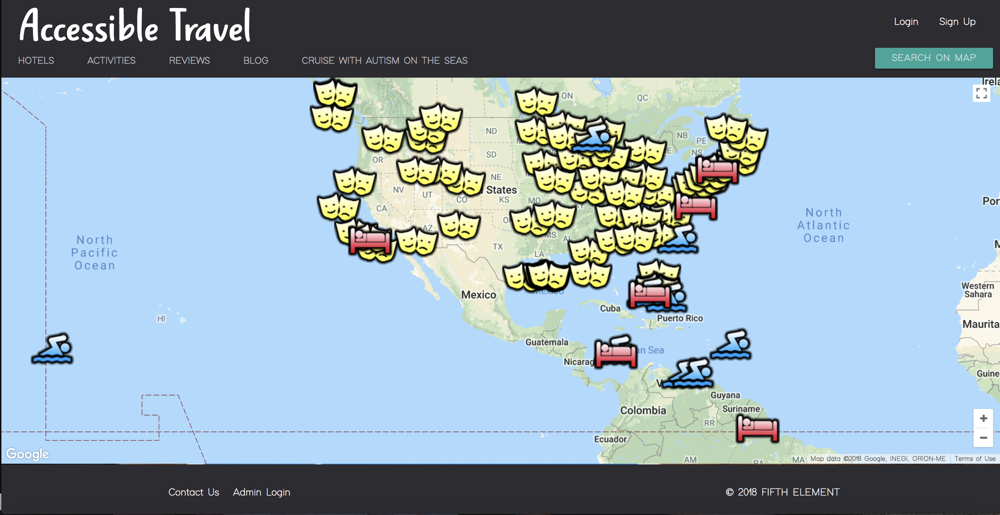

# Accessible Travel

Our goal with Accessible Travel is to create safe, sensory-friendly, certified travel options for parents and individuals on the Spectrum.
https://accessibletravel.herokuapp.com/

## Development Team

###### Shawn Connell | Back End Developer | Mongoose & React
https://github.com/Clickomat

###### Jessica Ball | Back End Developer | Mongoose & Autism Research
https://github.com/icesmooth2010

###### Kristen Yanni | Back End Developer | Google Maps API & React
https://github.com/Krizzle27

###### Brooke Mortensen | Front End Developer | Design & User Authentication
https://github.com/BrookeMo

###### Kim Howard | Front End Developer | Contact & Autism Research
https://github.com/kimberlyhoward

#### Technologies Used

- React.js
- XML
- HTML
- CSS
- Materialize
- Javascript
- Node.js
- jQuery
- Google Maps API
- MongoDB
- Mongoose
- JSON
- Firebase

## Pictures

###### Home Page

###### Login Modal

###### Map Page
